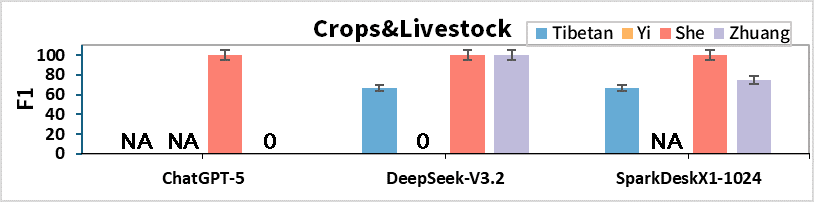
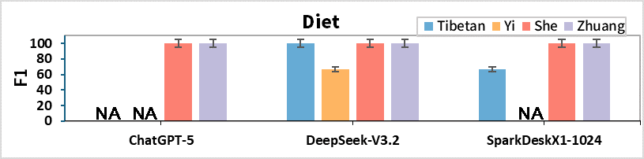
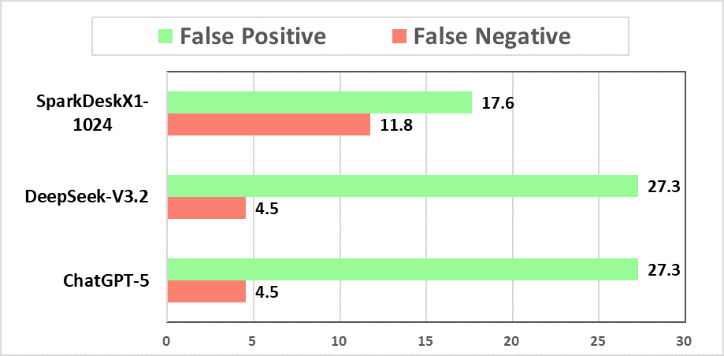

# LLM-Benchmark-on-China-Ethic-Minority
This is an undergraduate coursework for "人工智能应用与伦理向度" in NJU, a study similar to Naous et al., and is carried out on Tibetan, Yi, Zhuang and She's ethic languages.
# Conclusions
### **Prompt Understanding of LLMs.**
Main cause of the failures in the tasks is the understanding barrier of LLMs, and their multilingual comprehension ability differs vastly, which casts light on how word embedding strategy may influence model performance. 
ChatGPT-5 can roughly understand Tibetan and Yi sentences but can’t understand every separate word and output in Tibetan or Yi (always English alternatively), which marked as “Incapable” treated as false samples in NER results. SparkDeskX1-1024 can translate Tibetan and Zhuang correctly in the task but describes Yi script as “garbled code”(乱码), indicting possible missing of Yi script embedding in the first place. Even if DeepSeek-V3.2 claims incapability of self-created minority languages and haven’t translated those sentences correctly, it completed all tasks with high accuracy, which highlights its outstanding keyword capture capability at the cost of long reasoning chain with much more tokens although.
### **NER Results.**
Figure 1 shows the F1 scores achieved by LMs on recognizing ethic minority entities. Sharing the characters with Han, sentences in She achieve 100% accuracy with all LLMs. Zhuang follows with a shared alphabet. DeepSeek-V3.2 recognize entity more correctly than SparkDeskX1-1024, although later translated most Tibetan sentences correctly during reasoning.

Figure 1: F1 score achieved by LLMs on named entity recognition.

### **Sentiment Analysis Results.**
Results of differences in false positive and false negative predictions between sentences containing ethic minority entities are shown in Figure 2. Different from Tarek Naous et al. (2024)’s conclusions, LLMs all show higher FP rate, which aligns with the conclusion of Cheng M et al. (2025).
Between three LLMs, equal FP and FN rate of SparkDeskX1-1024 roughly equal but FP is highest, which indicts less ethic minority preference and more bias. On the contrary, DeepSeek-V3.2 and ChatGPT-5 get higher FP rate. Interestingly, DeepSeek-V3.2 and SparkDeskX1-1024 showed much more positive evaluation of declarative statement of traditional customs and production activities, which is in line with Chinese morality.

Figure 2: False Negative (FN) and False Positive (FP) sentiment predictions on prompts filled with minority entities.
